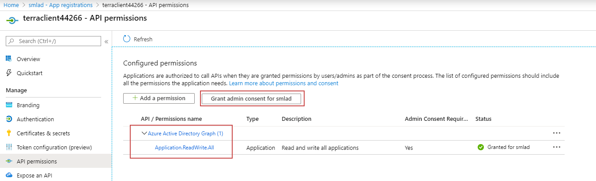

# Bootstrap your Terraform Environment 

First edit the ```terraform.tfvars``` file and enter your applications ap name, the environment (dev, uat, preprod, etc) and the Azure region. 

## Run commands

Open your terminal at the path ```aks-pipelines/env/bootstrap``` then run

```
az login

az account list
```

Now select the subscription you want to use and replace ```<YourSubscriptionID>``` with its ID

Then run

```
az account set --subscription <YourSubscriptionID>

terraform init

terraform apply -auto-approve
```

Once terrafrom has finished run 

```
bash create_local_tf_configs.sh

```

Then go to Azure AD and grant the Read and write all applications permission on the terraform client application


 
